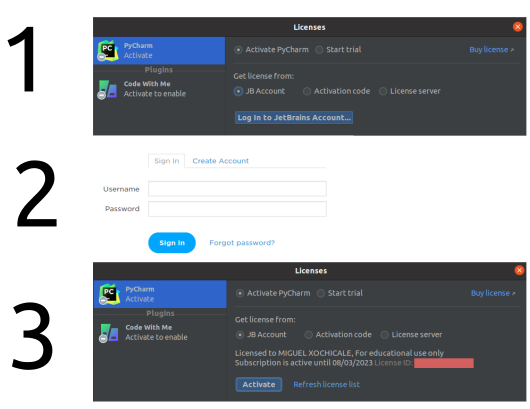
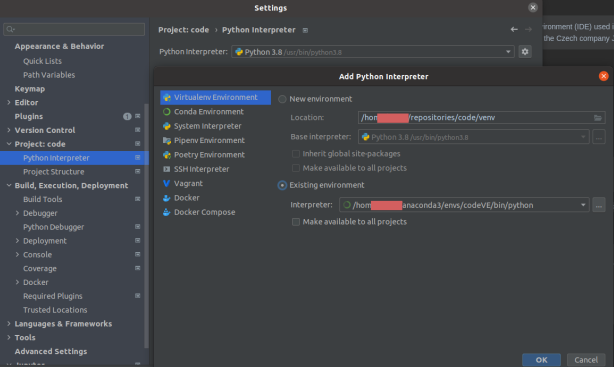

# PyCharm
> PyCharm is an integrated development environment (IDE) used in computer programming, specifically for the Python language. 
> It is developed by the Czech company JetBrains. [:books:](https://en.wikipedia.org/wiki/PyCharm)  

The following are instructions of the use of PyCharm under GNU/Linux with distributions of Ubuntu 18.04x64 and 20.04x64.

## 1. pycharm-community Installation 

### Option One [intermediate level]

* Check the latest version from https://www.jetbrains.com/pycharm/download/download-thanks.html?platform=linux&code=PC
* Copy and paste in the new version link in installation-community-version.bash

* Installation
```
cd $HOME/repositories/mxochicale/code/IDEs/pycharm
bash installation-community-version.bash
```
  * Confirm that you have read and accept the terms of this User Agreement
  * DATA SHARING: Don't send 
  * Import a project

Reference https://itsfoss.com/install-pycharm-ubuntu/


* Create Desktop app launch
```
    Start PyCharm.
    From the Tools menu, select "Create Desktop Entry..."
    # (seems to be optional)
    # Tick the corresponding box if you want the launcher for all users.
    # If you selected "Create entry for all users", you will be asked for your password.
    # A green message bubble should appear informing you that it was successful.
    # You should then be able to find PyCharm in the Unity Dash or pin it to the launcher.
    # Note: You may need a system restart before it appears.

```
Reference https://askubuntu.com/questions/391439/how-can-i-set-up-pycharm-to-launch-from-the-launcher

* Remove installation
```
cd $HOME/Downloads
rm -rf pycharm-community-2021.2.2/
```

### Option Two for installation [easy]
```
sudo snap install pycharm-community --classic
```


## 2. The Python IDE for Professional Developers using academic credentials 

2.1. Request education licences as a student of teacher at [JetBrains Products for Learning](https://www.jetbrains.com/shop/eform/students). You need your academic email.  
2.2. Download and install it via terminal.  
``` 
cd $HOME/repositories/code/IDEs/pycharm
bash installation-professional-version-with-student-licence.bash 
```
2.3. Activate licences  
  

See more: https://www.jetbrains.com/community/education/#students

## 3. Customisation 
### Setting conda environments
Open File>Settings (or Ctrl+Alt+S) to set up conda virtual environment


### Integration with Github 
* [Clone Git repositories using SSH](https://medium.com/@akshay.sinha/pycharm-integration-with-github-876510c6ca1f)


### Spell Checker Spanish Dictionary
```
Agregando el diccionario de español:
    Descarga los archivos aquí.
    Descomprime el zip.
    Dentro de la carpeta descomprimida en src/dict hay un archivo que dice spanish.0 y contiene muchas palabras en español, cambia su extensión a .dic.
    En PyCharm adentro de Settings/Editor/Spelling, en donde dice "Custom Dictionaries", agrega el archivo spanish.dic mencionado antes.
    Da click en "Apply" y listo, ahora PyCharm revisará también tu ortografía en español.
```
https://es.stackoverflow.com/questions/226011/    
https://plugins.jetbrains.com/plugin/7851-spell-checker-spanish-dictionary    

## 4 DataSpell 
> The IDE for Professional Data Scientists [:link:](https://www.jetbrains.com/dataspell/)
* Download
```
bash installation-dataspell.bash
#575M Jan 28 08:18  dataspell-2021.3.2.tar.gz
``` 

* Launch  
``` 
cd $HOME/Downloads/dataspell-2021.3.2/bin
sh dataspell.sh
```

* Make use of default env
Check list of env `conda env list`
``` 
TYPE: conda
CONDA_INSTALLATION: $HOME/anaconda3/bin/conda
CONDA_ENVIRONMENT: $HOME/anaconda3/envs/$ENV_NAME/bin/python
``` 

* remove settings and projects
```
rm -rf  $HOME/.config/JetBrains/DataSpell2021.3/
rm -rf $HOME/.config/JetBrains/DataSpell2021.3/projects
```

## Uninstalling
Remove the following directories:

Syntax
    ~/.config/JetBrains/<product><version>
    ~/.cache/JetBrains/<product><version>
    ~/.local/share/JetBrains/<product><version>


## References
* https://tecadmin.net/how-to-install-pycharm-on-ubuntu-20-04/  
* https://www.jetbrains.com/pycharm/download/#section=linux  
* https://itsfoss.com/install-pycharm-ubuntu  
* https://linuxhint.com/install_pycharm_ubuntu_2004/   
