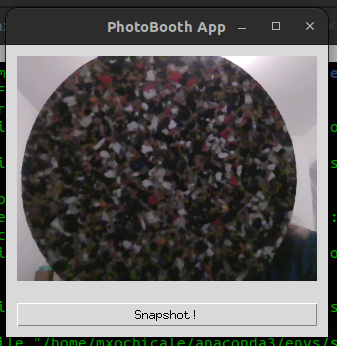

# Opencv and Tkinter 
> how to write a simple Tkinter GUI application that can display images loaded via OpenCV.
https://pyimagesearch.com/2016/05/30/displaying-a-video-feed-with-opencv-and-tkinter/ 

## Scripts
``` 
conda activate simpleVE
mkdir snapshots_path
python photo_booth.py --output snapshots_path
```
 

See [snapshots](snapshots_path).


## Errors

* "SyntaxError: multiple exception types must be parenthesized" 

> I just figured out what the cryptic "SyntaxError: multiple exception types must be parenthesized" message means. All it's trying to tell you is that in the newer version of Python you're using, this syntax is no longer valid:

instead of  `except COMError, err:`, you should be using this syntax  `except COMError(err):`

https://stackoverflow.com/questions/70648404/syntaxerror-multiple-exception-types-must-be-parenthesized  


* `AttributeError: 'PhotoImage' object has no attribute '_PhotoImage__photo'`
```
python photo_booth.py --output snapshots_path
[INFO] warming up camera...
[INFO] saved snapshots_path/2023-01-07_17-19-44.jpg
[INFO] closing...
Exception in thread Thread-1 (videoLoop):
Traceback (most recent call last):
  File "/home/mxochicale/repositories/mxochicale/code/opencv/examples/python/opencv-tkinder/photo_booth.py", line 67, in videoLoop
    image = ImageTk.PhotoImage(image)
            ^^^^^^^^^^^^^^^^^^^^^^^^^
  File "/home/mxochicale/anaconda3/envs/simpleVE/lib/python3.11/site-packages/PIL/ImageTk.py", line 127, in __init__
    self.__photo = tkinter.PhotoImage(**kw)
                   ^^^^^^^^^^^^^^^^^^^^^^^^
  File "/home/mxochicale/anaconda3/envs/simpleVE/lib/python3.11/tkinter/__init__.py", line 4120, in __init__
    Image.__init__(self, 'photo', name, cnf, master, **kw)
  File "/home/mxochicale/anaconda3/envs/simpleVE/lib/python3.11/tkinter/__init__.py", line 4065, in __init__
    self.tk.call(('image', 'create', imgtype, name,) + options)
RuntimeError: main thread is not in main loop

During handling of the above exception, another exception occurred:

Traceback (most recent call last):
  File "/home/mxochicale/anaconda3/envs/simpleVE/lib/python3.11/threading.py", line 1038, in _bootstrap_inner
    self.run()
  File "/home/mxochicale/anaconda3/envs/simpleVE/lib/python3.11/threading.py", line 975, in run
    self._target(*self._args, **self._kwargs)
  File "/home/mxochicale/repositories/mxochicale/code/opencv/examples/python/opencv-tkinder/photo_booth.py", line 79, in videoLoop
    except RuntimeError('error'):
TypeError: catching classes that do not inherit from BaseException is not allowed
Exception ignored in: <function PhotoImage.__del__ at 0x7fe5b59865c0>
Traceback (most recent call last):
  File "/home/mxochicale/anaconda3/envs/simpleVE/lib/python3.11/site-packages/PIL/ImageTk.py", line 133, in __del__
    name = self.__photo.name
           ^^^^^^^^^^^^
AttributeError: 'PhotoImage' object has no attribute '_PhotoImage__photo'

```

Potential solutions: 
https://stackoverflow.com/questions/50662773/attributeerror-photoimage-object-has-no-attribute-photoimage-photo   
