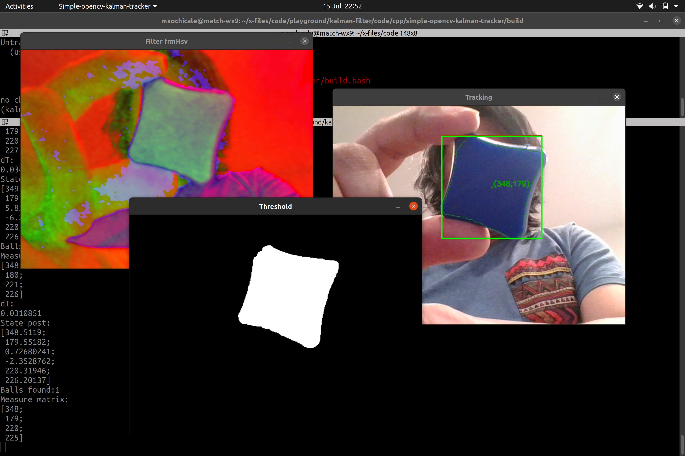

# OpenCV Tutorial: Ball Tracking using with Kalman Filter  

## build
```
rm -rf build && bash build.bash 
```

## Run 
```
cd build 
./simple-opencv-kalman-tracker 
```



## References
https://github.com/Myzhar/simple-opencv-kalman-tracker    
https://www.myzhar.com/blog/tutorials/tutorial-opencv-ball-tracker-using-kalman-filter/   
https://www.youtube.com/watch?v=sG-h5ONsj9s&feature=emb_title    
