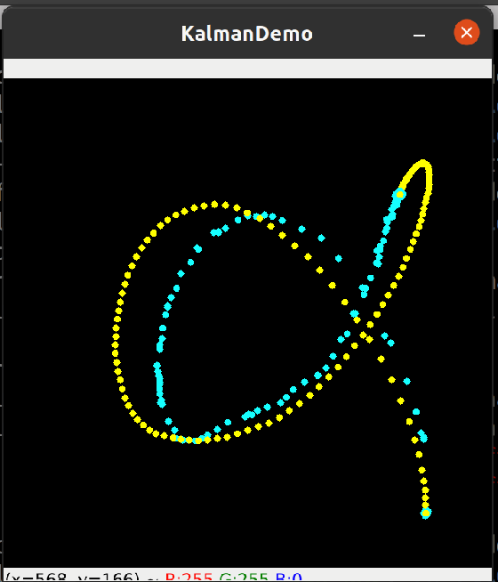

# kalman_demo
Reference for [kalman_demo.py](https://github.com/cyber-tuna/kalman_demo/blob/master/kalman_demo.py).

## install environment and package 
See [README](create-virtual-environments/README.md)

## Dependencies
sudo apt install libcanberra-gtk-module libcanberra-gtk3-module

## Run environment 
1. Open a terminal 
2. Run:
```
conda activate kalmanVE
```

## Run Script(s)
Open a terminal and run
```
python script.py
```
then make a click and move mouse one as shonw in below 


