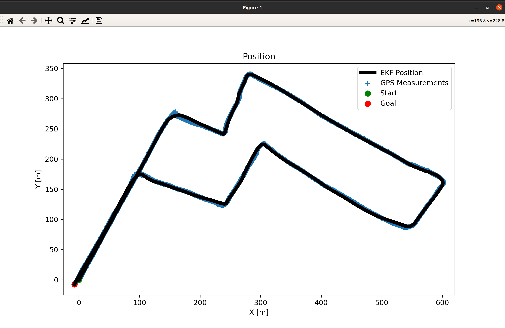
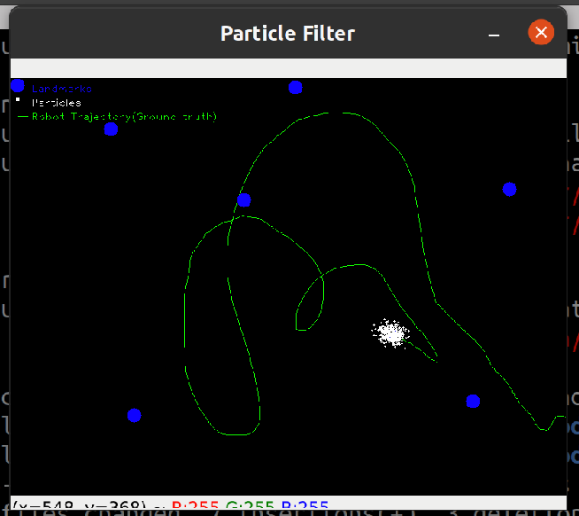

# Filters 

## Dependencies
sudo apt install libcanberra-gtk-module libcanberra-gtk3-module


## Run environment 
1. Open a terminal 
2. Run:
``` 
conda activate kalmanVE
```

## Run Scripts
``` 
cd src
python KalmanFilter.py
```


```
python  ExtendedKalmanFilter.py
```




```
python ParticleFilter.py
```


