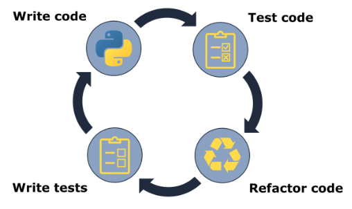

# Python Testing with Pytest

## Unit testing
The typical testing workflow is showing below ([py-pkgs-testing](https://py-pkgs.org/05-testing.html)).     


```
mamba activate eVE
pytest -sv tests/yaml_files/test_simple.yaml 
```
* Options
```
#-s option. All print statements -v it's a short --verbose
-m?
-k?
```

## References 
* https://github.com/jashburn8020/python-testing-with-pytest 
* https://docs.python.org/dev/library/unittest.mock.html
* https://pypi.org/project/pytest-mock/

