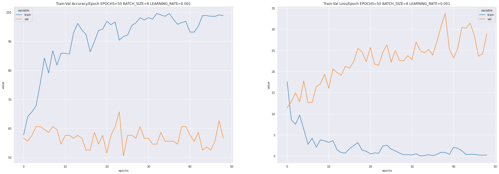
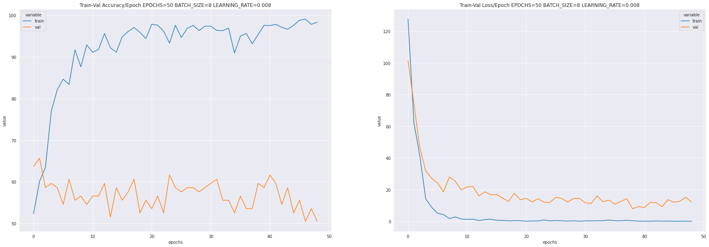
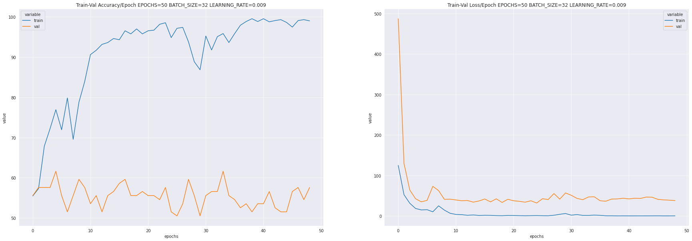
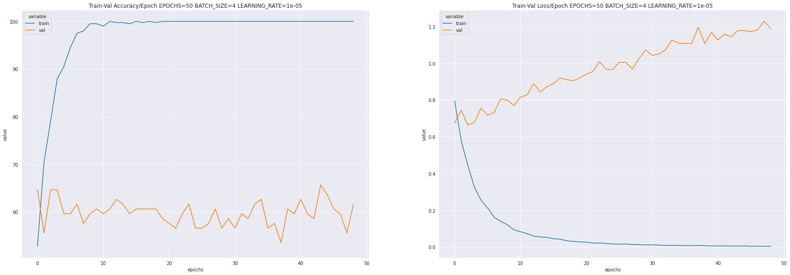
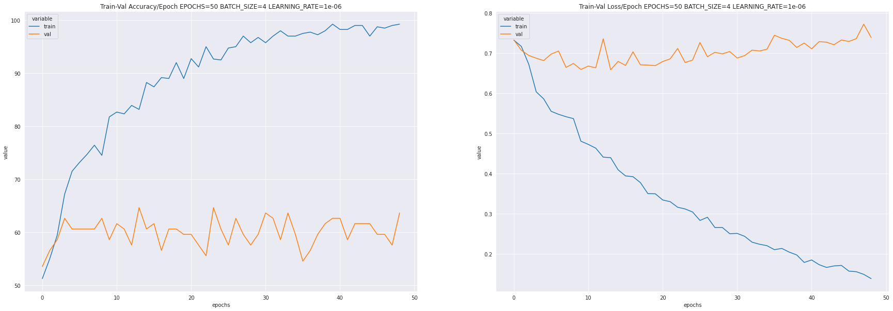
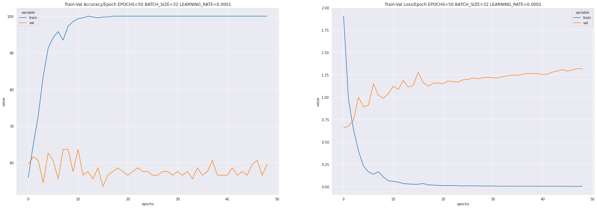
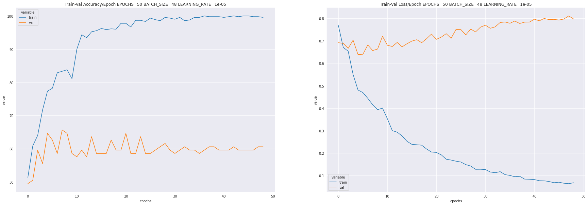
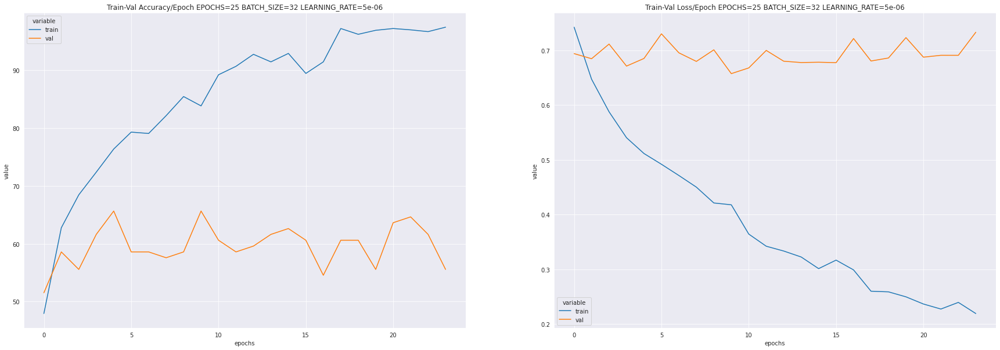

# Replicating PyTorch [Vision] — Binary Image Classification

## Conda environment 
Current [ve.yml](../../conda-virtual-environment/ve.yml) was migrated to [codeVE.yml](../../../conda/create-virtual-environments/codeVE.yml)

## Datasets
https://www.kaggle.com/dansbecker/hot-dog-not-hot-dog

* Path distribution 
```
cd $HOME/datasets/hot-dog-not-hot-dog
tree -d
.
├── seefood
│   ├── test
│   │   ├── hot_dog
│   │   └── not_hot_dog
│   └── train
│       ├── hot_dog
│       └── not_hot_dog
├── test
│   ├── hot_dog
│   └── not_hot_dog
└── train
    ├── hot_dog
    └── not_hot_dog
```

* Number files 
```
$/datasets/hot-dog-not-hot-dog/test: 2 directories, 500 files
..
├── hot_dog: 0 directories, 250 files
└── not_hot_dog: 0 directories, 250 files

$/datasets/hot-dog-not-hot-dog/train:2 directories, 498 files
.
├── hot_dog: 0 directories, 249 files
└── not_hot_dog: 0 directories, 249 files
```


## Script 
```
cd $HOME/repositories/code/pytorch/examples/binary_image_classification
conda activate codeVE
jupyter notebook
```

## Results

### With `nn.CrossEntropyLoss()` and `optim.Adam(model.parameters(), lr=LEARNING_RATE)`
Accuracy and loss curves with different values of epochs, batch_size and learning rate.

* EPOCHS50__BATCHSIZE08__LEARNINGRATE0-001


* EPOCHS50__BATCHSIZE08__LEARNINGRATE0-008


* EPOCHS50__BATCHSIZE32__LEARNINGRATE0-009


* EPOCHS50__BATCHSIZE04__LEARNINGRATE0-00001


* EPOCHS50__BATCHSIZE04__LEARNINGRATE0-000001


* EPOCHS50__BATCHSIZE32__LEARNINGRATE0-0001


* EPOCHS50__BATCHSIZE48__LEARNINGRATE0-00001


* EPOCHS25__BATCHSIZE32__LEARNINGRATE0-00001


## Issues
* BATCH_SIZE = 64 #RuntimeError: Unable to find a valid cuDNN algorithm to run convolution

## References
https://towardsdatascience.com/pytorch-vision-binary-image-classification-d9a227705cf9 
