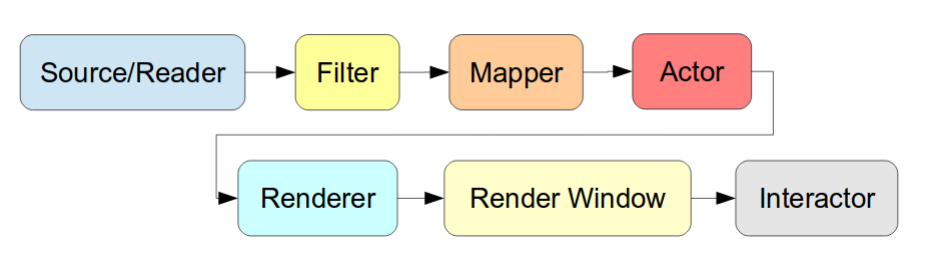

# The Visualization Toolkit (VTK)  
Free software system for 3D computer graphics, image processing and visualization [:link:](https://vtk.org/)

## History
> VTK was initially created in 1993 as companion software to the book The Visualization Toolkit: An Object-Oriented Approach to 3D Graphics.[5] The [book](https://github.com/lorensen/VTKExamples/blob/master/src/VTKBook/01Chapter1.md) and software were written by three researchers (Will Schroeder, Ken Martin and Bill Lorensen) on their own time and with permission from General Electric (thus the ownership of the software resided with, and continues to reside with, the authors). After the core of VTK was written, users and developers around the world began to improve and apply the system to real-world problems.[3]
https://en.wikipedia.org/wiki/VTK

## Visualisation pipeline
VTK made use of the following pipeline, which seems to be inspired by [OpenGL pipeline](https://www.khronos.org/opengl/wiki/Rendering_Pipeline_Overview), to contruct geometric representations that are rendendered by the graphics pipeline.


1. SOURCE/READER: Load data, use source classes (vtkSphereSource, vtkCubeSource, vtkConeSource), or read data from files (Polydata, StructuredGrid).
	* VTK Data objects: – vtkImageData, vtkRectilinearGrid, vtkStructuredGrid, vtkPolyData, vtkUnstructuredGrid
	* Usually you create an iterator: `cube = vtk.vtkCubeSource()` and you can accesss vtkPolyData instance `polyData = cube.GetOutput()`
2. FILTER: Takes data, modify it and returns the modified data.
	* Select data of particular size, strenght, intensity, 
	* Process 2D/3D images or polygon messhes
	* Generate geometric objects from data
3. MAPPER: Maps data to graphics primitives that can be displayed by the renderer.
	* Multiple mappers may share the same input but render in different way
	* Usual mapper: vtkPolyDataMapper
	* Set connection between source and mapper
		* create mapper: `cubeMapper = vtk.vtkPolyDataMapper()`
		* stablish connection: `cubeMapper.SetInputConnection(cube.GetOutputPort())`
4. ACTOR: represents and object in a rendenring scene
	* Rendering properties is generated by the properties configuation (scale, orientation, textures)
5. RENDERER: controls the rendering process for actors and scenes
	* Perform coordinate transformation between multiplate coordinates (world, view and camera).
	* `vtkRenderWindow` class creates a window for renderers to draw into
6. INTERACTORS: 
	* The `vtkRenderWindowInteractor` class provides platform-independent window interaction via the mouse and keyboard

See https://mt4sd.ulpgc.es/slicer-int/images/7/71/VTK.pdf for further reference.

## Examples 
To launch scripts, open a terminal, activate virtual envirohment and run python script:
```
conda activate bareVE
python *.py 
```
Useful command to debut apps
```
kill $(ps auxf | grep 'python *.py' | grep -v grep)
kill $(ps auxf | grep 'pytest' | grep -v grep)
```
### Tutorial  
### Examples 
### Examples-pyside6-vtk
 
## References 
* https://kitware.github.io/vtk-examples/site/Python/#tutorial
* https://www.toptal.com/data-science/3d-data-visualization-with-open-source-tools-an-example-using-vtk 
* https://github.com/lorensen/VTKExamples/blob/master/src/VTKBook/01Chapter1.md 
* https://github.com/lorensen/VTKExamples/tree/master/src/VTKBookLaTeX 
